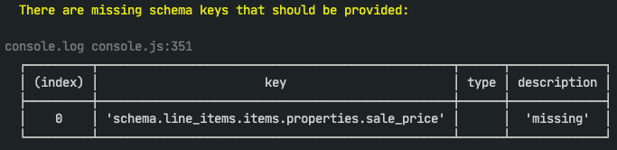
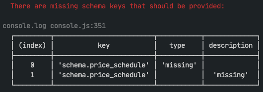
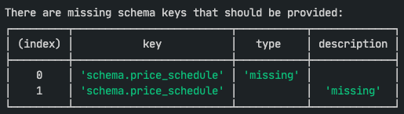

# Schema Generation

## Overview

A standardised way of generating operation input schemas in manual connectors.

## Advantages

### Clean code

The `schema.js` files only require one function for schema generation. The way that the parameters are passed looks very clean, minimal and easy to read.

### Immutable schema

The operation input schema returned from the generator function is a deep copy of the original schema definition. Therefore, you cannot mutate or alter the original schema in any way.

### Easy override of properties with deep merge

The original schema definition defines the standard properties to be used by the connector operations but it is easy to override any schema property in any operation by providing a new value. Overrides are applied using a deep merge algorithm.

### DRY schema elements

Since each schema element is only defined once and reused across operations there is no need to repeat yourself and duplicate code.

## Concepts

### One schema object

The entire schema definition for the whole connector is combined into one object.

You can split this up into separate helper files to make it more manageable and then require and combine those definitions in another helper file.

### One generator function

There is one generator function that can generate the schema definition for any operation.

Simply, call the function and pass in an object with the schema keys that you require.

Override any schema parameter by providing a new value.

## Example operation schema

### Show me the code 👀

```javascript
const { generateInputSchema } = require('@trayio/connector-utils');
const { fullSchema } = require('../../../helpers/schema');

module.exports = {
	description: 'Create a new line item.',
	input: generateInputSchema({
		operation: 'createLineItem',
		schema: fullSchema,
		keys: {
			order: { required: true },
			quantity: {
				required: true,
				description: 'Number of units ordered.',
			},
			notes: { description: 'Notes for this specific ordered product.' },
			is_packed: { alias: 'packed' },
			packed_at: {},
			packed_by: {},
		},
		arrayMergeType: 'concatenate',
	}),
};
```

### Explanation

1. Require the schema generation function from `@trayio/connector-utils`

2. Require the full connector schema definition from a helper file. The full schema can be made up of many schema fragments that are required from other helper files and assembled into one full schema definition for the whole connector.

3. Export the schema definition, as usual.

4. Include any schema parameters and functions, as normal

5. To generate the input schema, call the `generateInputSchema` function and pass in an object containing the `operation` name, the full connector `schema` and any schema `keys` and values that you require for the operation

    1. In this case, we are asking for the the schema definitions corresponding to the following named keys: `order`, `quantity`, `notes`, `is_packed`, `packed_at` and `packed_by`

    2. The first two keys (`order` and `quantity`) are required, so we assign an object to those keys that overrides the `required` key with a value of `true`, i.e.

        ```javascript
        {
        	required: true;
        }
        ```

    3. The second and third keys (`quantity` and `notes`) need different descriptions than those provided by the standard schema definition so we override them as follows:

        ```javascript
            quantity: { required: true, description: 'Number of units ordered.' },
            notes: { description: 'Notes for this specific ordered product.' },
        ```

    4. The fourth key (`is_packed`) defines an alias to override the original key. When the schema is generated, all references to `is_packed` will be replaced by `packed`. You will therefore reference this schema key as `packed` in the operation's parameters and model.

    5. The rest of the keys will take values that have been defined in the standard schema definition. This is done by assigning an empty object `{}` to the keys. Since the object contains no keys or values, there is nothing to override.

    6. Finally, you may (optionally) specify the merge strategy for arrays. In this example, we are saying that we wish arrays to be concatenated when merging (which is the default strategy).

## Logging Schema Issues

The schema generator automatically checks the generated schema for issues. It will detect when `type` keys and `description` keys are missing. It will also report missing full stops in descriptions.

Issues are logged to the console whenever the schema is generated. In practice, this means that whenever you invoke the `test-runner` or `node-dev main.js` you will be able to see and fix schema issues.

The whole of the operation input schema is checked using a recursive algorithm.

Here's some sample output when using the `test-runner` (warning):



When using the `test-runner` (error):



When using `node-dev main.js`:



Missing `description`s and full stops are logged as warnings.

This is really useful for catching and fixing QA issues (before they happen) where input tooltips are missing.

Missing `type`s are logged as errors.

If you see missing types it usually means that the schema key that you requested doesn't exist in the full connector schema object.

## Deep Merge of Objects and Arrays

When overriding schema elements with new schema fragments, we deep merge the existing and new schemas together. All mergeable objects will be deep merged. However, some schema element types need to be merged in specific ways. Arrays can be merged in a number of different ways:

### Concatenating Arrays

Setting `arrayMergeType`: `'concatenate'` will merge arrays by concatenating values (default).

e.g.

-   original: `['One', 'Two', 'Three']`
-   override: `['Four', 'Five']`
-   result: `['One', 'Two', 'Three', 'Four', 'Five']`

### Combine Arrays by Index

Setting `arrayMergeType`: `'combineByIndex'` will merge/combine arrays by index value.

-   arrays of objects will merge by index (if possible)
-   other types will concatenate (ignoring value duplication overlap)

e.g.

-   original: `['One', 'Two', 'Three']`
-   override: `['Two', 'Four', 'One', 'Five']`
-   result: `['One', 'Two', 'Three', 'Four', 'Five']`

**Explanation:**

We start by copying the original array and this forms the basis of the output array. Looking at the override array:

-   Index 0 - `Two` already exists in the original array so it is ignored.
-   Index 1 - `Four` is appended because it does not appear at index 0, 1 or 2 of the original array.
-   Index 2 - `One` already exists in the original array so it is ignored.
-   Index 3 - `Five` is appended because its index is beyond the scope of the original array.

### Overwrite Arrays by Index

Setting `arrayMergeType`: `'overwriteByIndex'` will merge/overwrite arrays by index value.

-   arrays of objects will merge by index (if possible)
-   other types will overwrite by index value

e.g.

-   original: `['One', 'Two', 'Three']`
-   override: `['Three', 'Four']`
-   result: `['Three', 'Four', 'Three']`

**Explanation:**

We start by copying the original array and this forms the basis of the output array. Looking at the override array:

-   Index 0 - `Three` overwrites `One` at index 0 of the original array.
-   Index 1 - `Four` overwrites `Two` at index 1 of the original array.
-   Index 2 - The override array doesn't have a value at index 2 so the original value `Three` is kept.

### Overwrite Arrays

Setting `arrayMergeType`: `'overwrite'` will overwrite the original array with the specified array

e.g.

-   original: `['One', 'Two', 'Three']`
-   override: `['Four', 'Five']`
-   result: `['Four', 'Five']`
